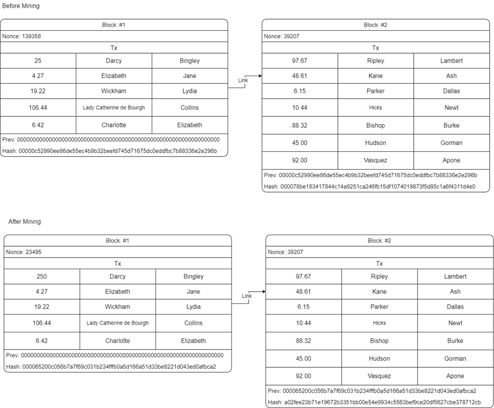

## W1L1
### Problem statement 
*Basic demonstration of blockchain technology. URL: (a)	https://andersbrownworth.com/blockchain (b)	https://coindemo.io/ (c)	https://blockchaindemo.io/*

1. Design a block using some data and mine to understand the change in values of Nonce and hash key. 
  

2. Design a blockchain using some data and mine to understand the change in values of previous and next hash key. 
  

3. Design a distributed blocks of chain and mine to undestand the change in values of previous and next hash of different peers. 
  

4. Design a blocks of token and mine to understand the change in nonce values. And also observe change in values of previous and next hash keys. 
  

5. Design a coin base of blockchain and understand the change in nonce values. Also, we observe change in previous and next hash keys. 
  
