## W2L2
### Problem statement 
*Demonstrate Metamask wallet setup and transactions
https://metamask.io/*

1. Download the metamask web application on google chrome 
  
 
 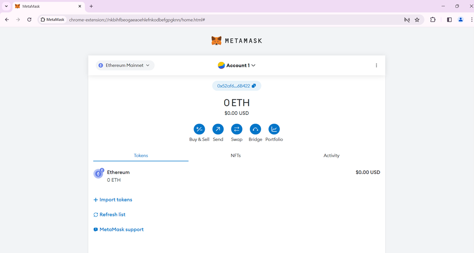 

2. Select a network that provides ether for testing and learning about the Ethereum cryptocurrency. We can choose Sepolia network for testing on our account. 
 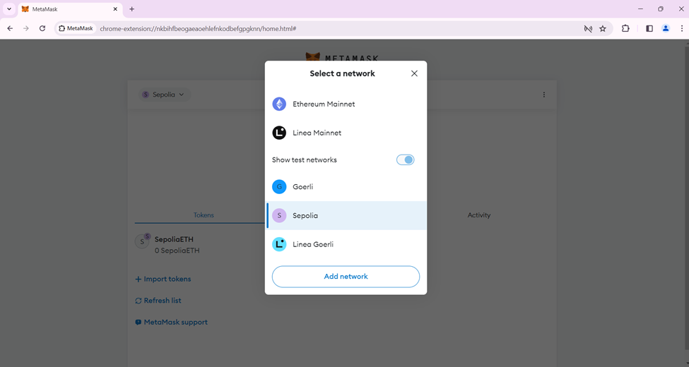 

3. We can get ethers from Ethereum Sepolia Faucet. This is a website from alchemy, which provides ether for learning and testing about how a transaction is processed at the backend. Login in to the sepolia faucet website, which consists of authentication and verification of a user. After login, go to Ethereum Sepolia tab and check whether the “Send Me ETH” is highlighted or not. This means, if the connection is safe and no objects are present on the network, then we can process the transaction. Or the transaction may not be possible, as the connection or network does not allow for suchh transactions. 
 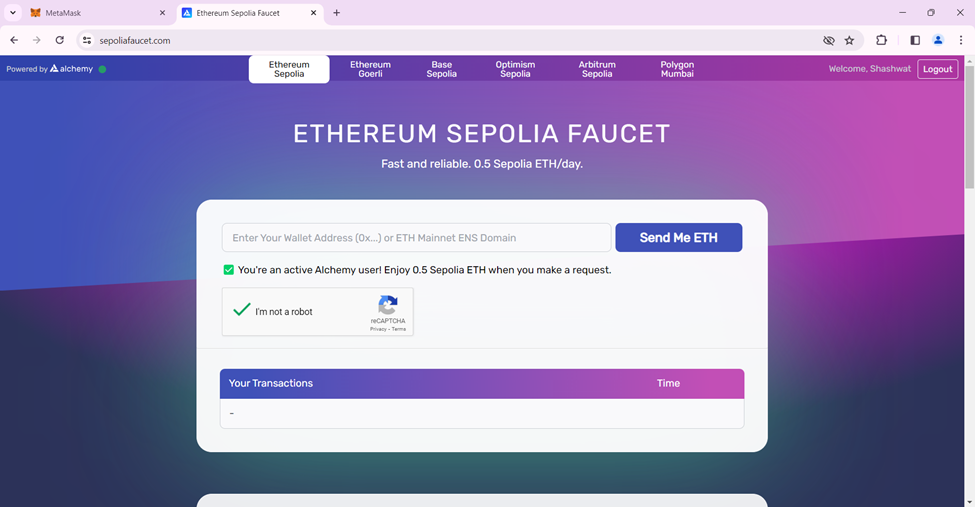 
 
 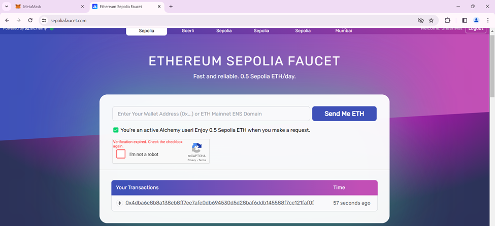 

4. After copying the address of Meta Mask account into the Ethereum Sepolia Faucet, enter the “Send Me ETH” button and it proceeds with the successful transaction to the account. By default, Sepolia sends 0.5 Sepolia ETH into the account on Sepoila network. 
 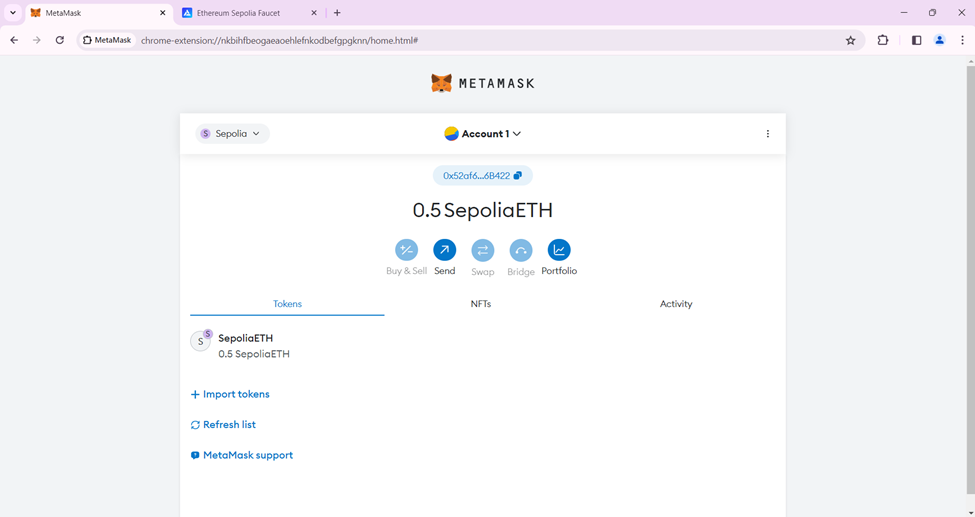 
 
 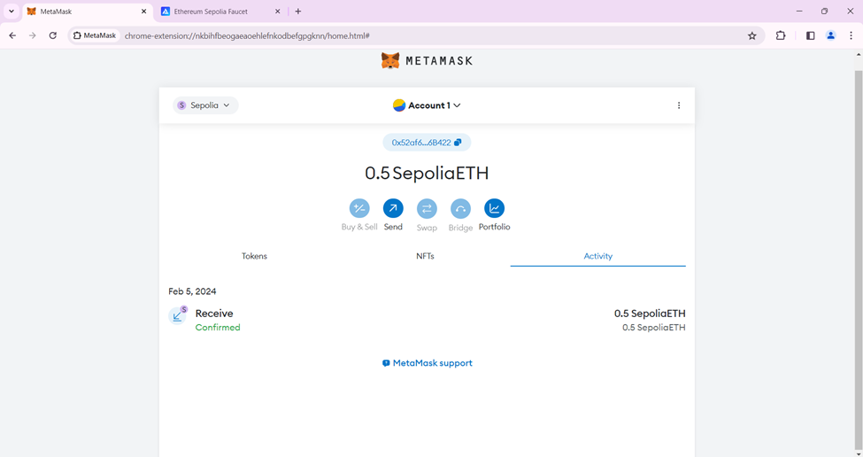 

5. We can send Sepolia ETH to another account using the address. 
 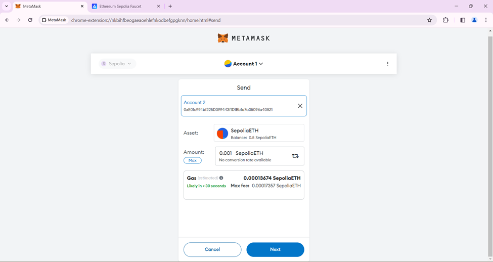 
 
 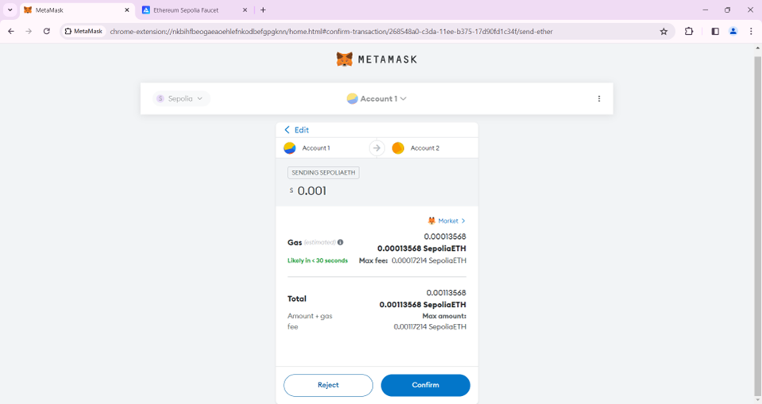 

6. After a successful transaction, the left ETH is displayed on the main page of the account. The page also describes about the activities, here send and receive are having status “confirmed” transaction between the entities. 
 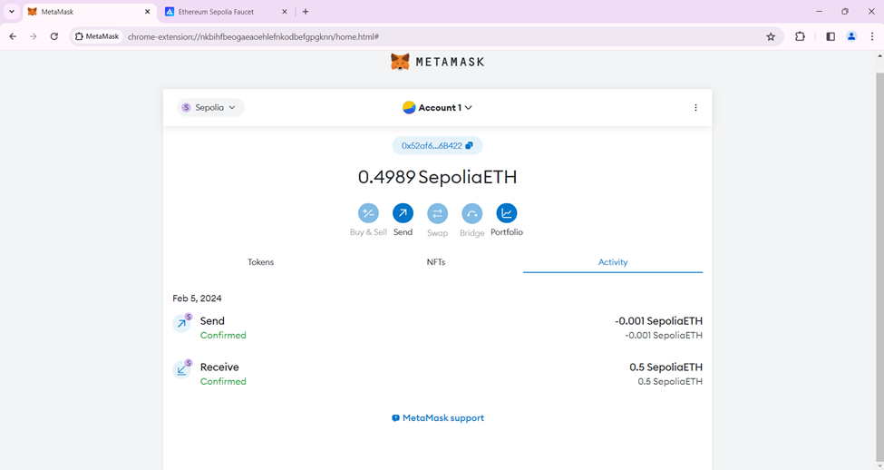 
 
 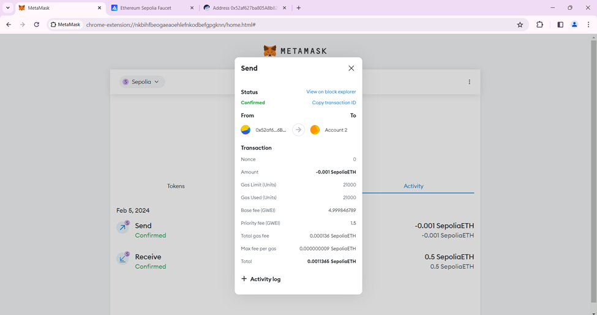 
 
 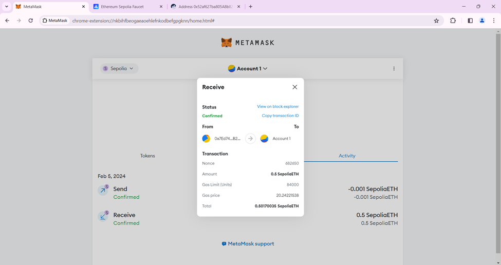 

7. We can get more information of the transaction from etherscan.io website of sepoila. 
 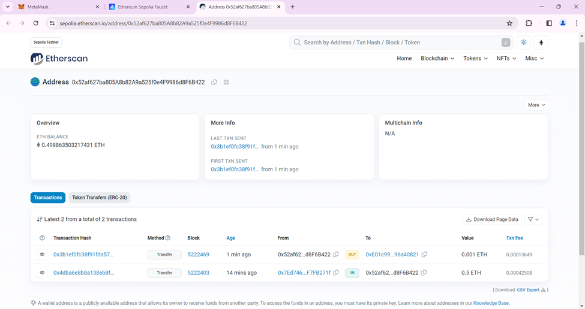 

8. Linea is another network for getting ETH. 
 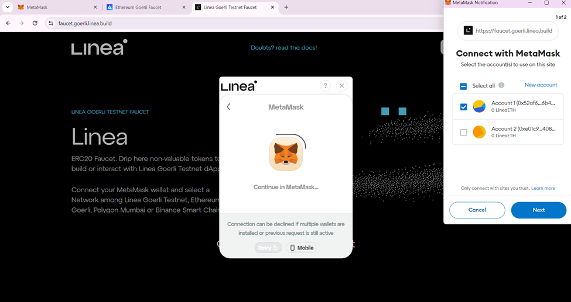 
 
 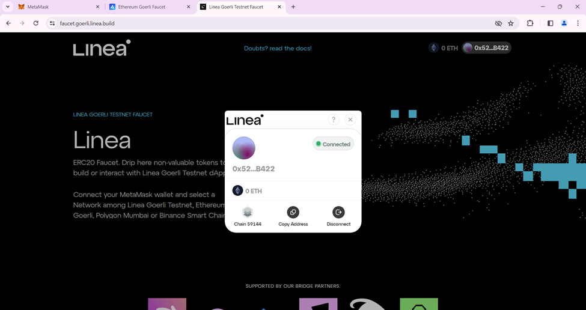 
