## W3L3
### Problem statement 
*Blockchain explorer for Bitcoin and Ethereum – Study and understand the various statistics observations related to bitcoin and Ethereum cryptocurrencies, https://www.blockchain.com/explorer, https://etherscan.io/*

1. Explore the explorer section of blockchain.com web interface. 
 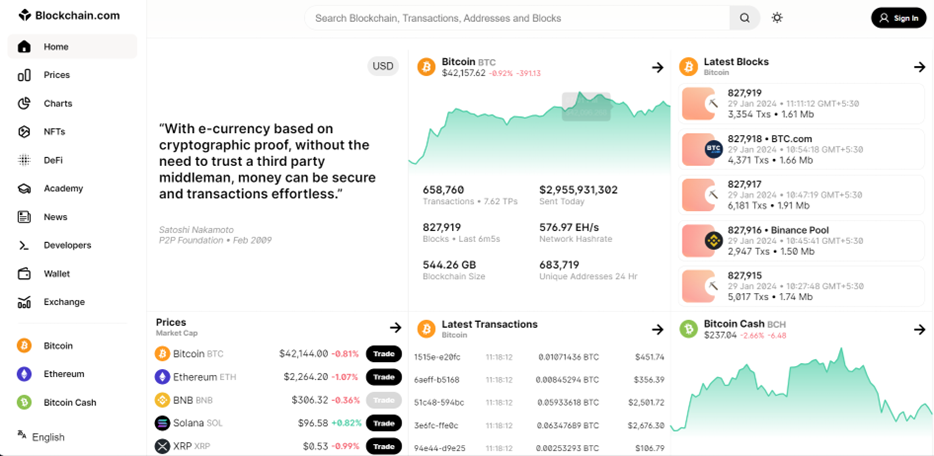 
 In explorer section, we can get to know about a blockchain currency. This includes Bitcoin. We can visualize currencies through a graph, get latest prices of the Bitcoin, get most recent transactions of a currency here Bitcoin. We can also view latest blocks created in the Bitcoin

2. Explore the price section of blockchain.com web interface. 
 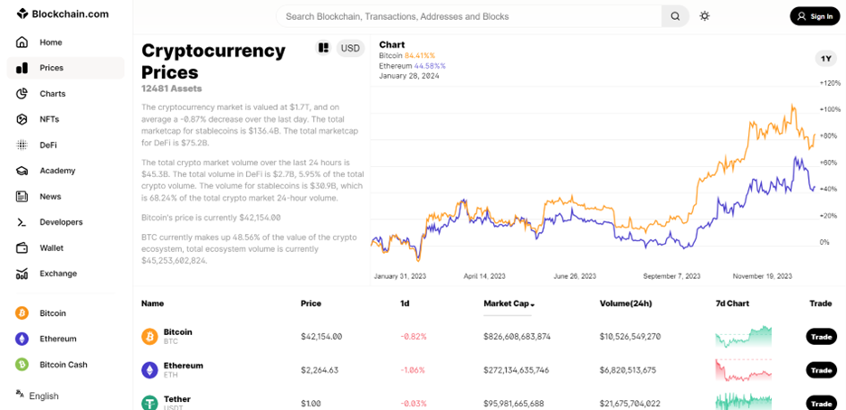 
In prices section, we can get to know the prices of other cryptocurrencies. 
 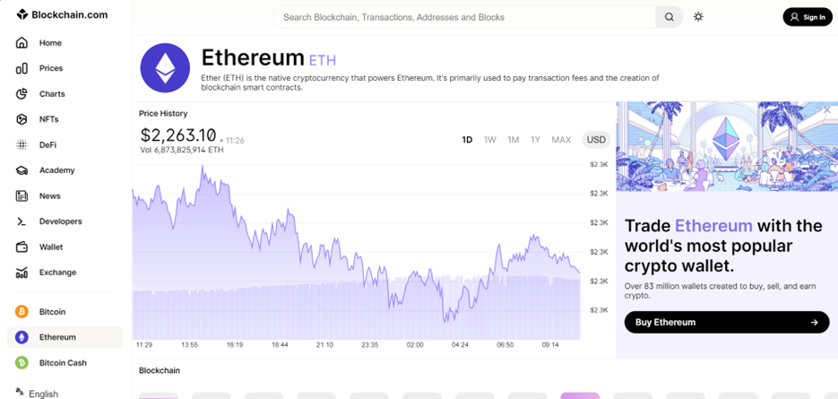 
 
 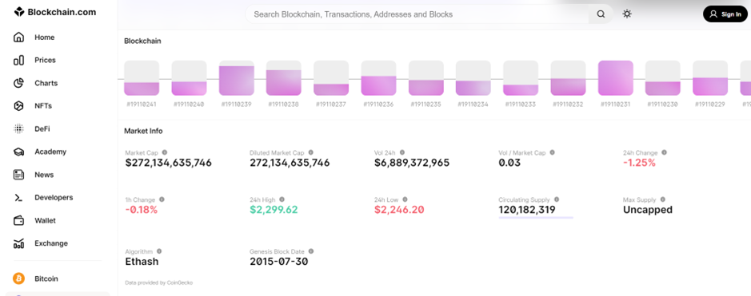 
 
 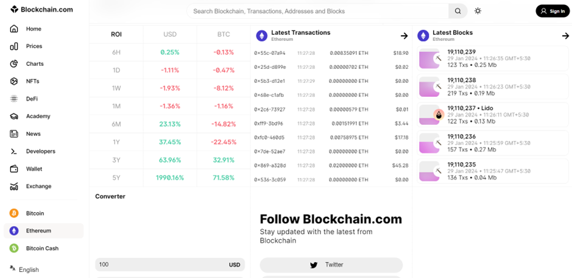 
 A cryptocurrency, when selected from the list of the currencies, we can get to know the information about the currency. When a new block is generated, a unique id is also generated to a particular block.

3. Explore the NFT section of blockchain.com web interface.  
 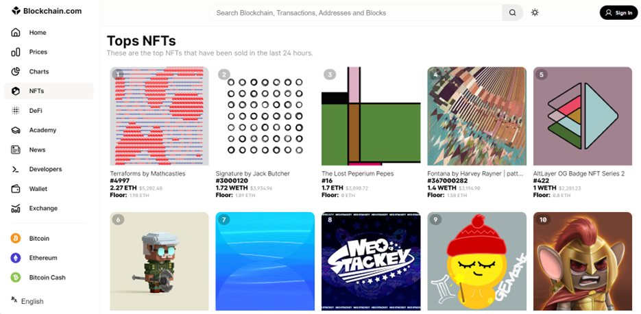 
 Non-fungible tokens (NFTs) are assets on a blockchain with unique identification codes and metadata that distinguish them from each other. Encryption functions generate unique tokens from metadata. Blockchains then store the data, while the assets themselves are stored in other places. The connection between the token and the asset is what makes them unique. NFTs can be traded and exchanged for money, cryptocurrencies, or other NFTs—it all depends on the value the market and owners have placed on them. For instance, you could draw a smiley face on a banana, take a picture of it (which has metadata attached to it), and tokenize it on a blockchain. Whoever has the private keys to that token owns whatever rights you have assigned to the token.
Cryptocurrencies are tokens as well; however, the key difference is that two cryptocurrencies from the same blockchain are interchangeable—they are fungible. Two NFTs from the same blockchain can look identical, but they are not interchangeable.

4. Explore the Wallet section of blockchain.com web interface. 
 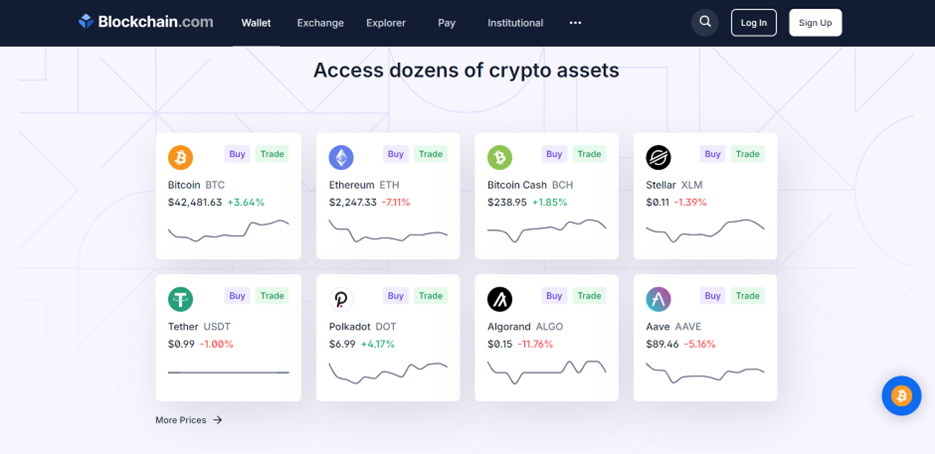 
 E-wallets allow individuals to store cryptocurrencies and other digital assets. In the case of Blockchain Wallet, users can manage their balances of various cryptocurrencies such as the well-known Bitcoin and Ether as well as stellar, Tether, and Paxos Standard.
Creating an e-wallet with Blockchain Wallet is free, and the account setup process is done online. Individuals must provide an email address and password that will be used to manage the account, and the system will send an automated email requesting that the account be verified.
Once the wallet is created, the user is provided with a Wallet ID, which is a unique identifier similar to a bank account number. Wallet holders can access their e-wallet by logging into the Blockchain website, or by downloading and accessing a mobile application.
The Blockchain Wallet interface shows the current wallet balance for crypto-assets and the user’s most recent transactions. Users can also access the price charts and see the value of the funds in the chosen local currency of the user. 

5. Explore the etherscan.io web interface. 
 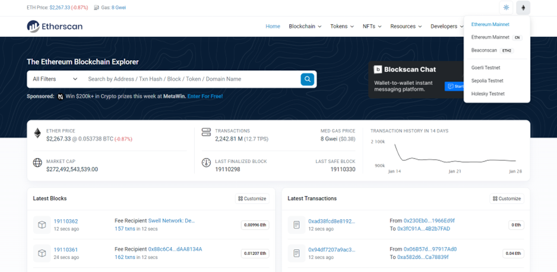 
 
 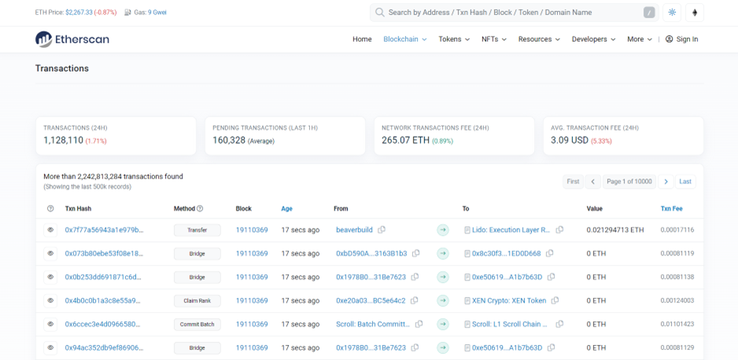 
 In transactions section of blockchain, we can get the details of the transactions. 
 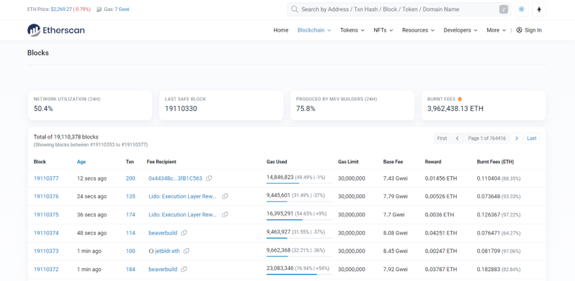 
 In blocks section of blockchain, we can get the details of newly generated blocks. 
 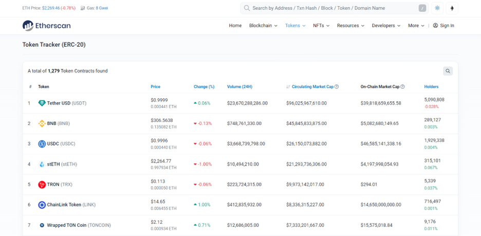 
 In tokens section, we can get details of contracts of tokens. 
  
 In NFT section, we can get details of latest activities happening within various collections.
