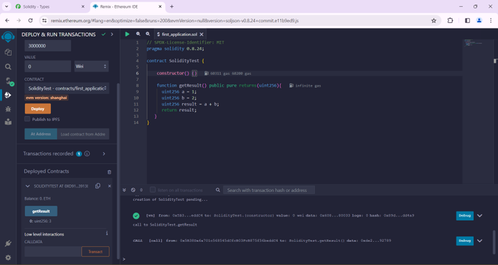
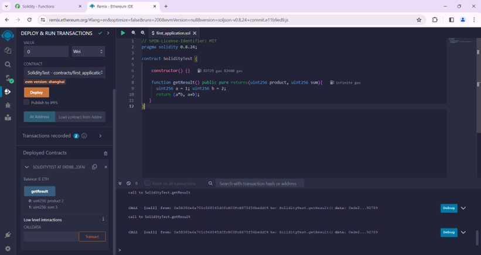
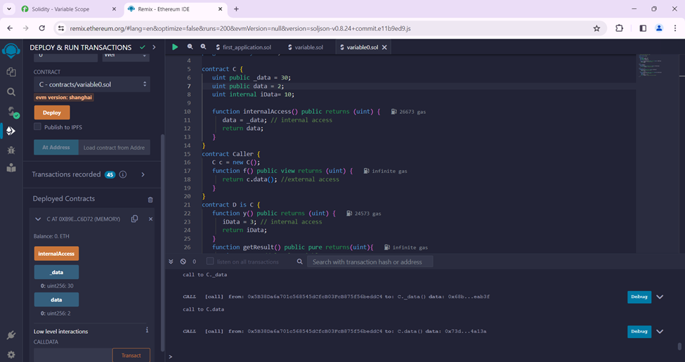
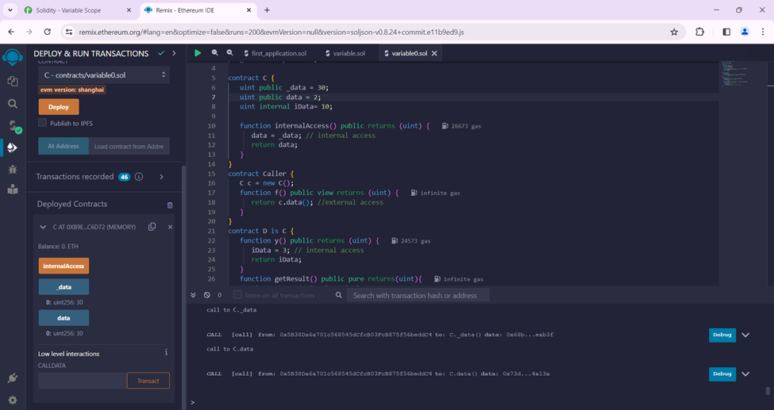

## W4L4
### Problem statement 
*Demonstrate Solidity programming of simple smart contract URL: https://www.tutorialspoint.com/solidity/solidity_first_application.html, URL: https://remix.ethereum.org/*

1. Explore the contracts in remix ide in solidity programming language.
  
 
  
 We can create a function of addition using basic arithmetic operators. To run the contract, we can use pragma solidity and version as the library. Include the license before deploying the contract.

2. Write a function which is being called by the parent contracts and observe the output in child contracts. 
  
 
  
 We can deploy a smart contract by clicking on deploy. 
