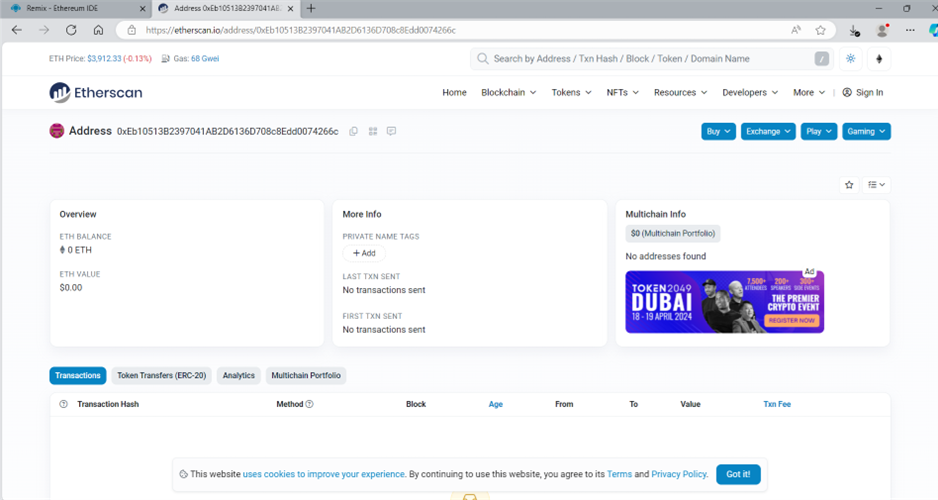

## W5L5
### Problem statement 
*Install Ganache Blockchain test network and deploy smart solidity smart contract. URL: https://www.trufflesuite.com/ganache*

1. Connect the contract built in remix ide to local environment using JSON-RPC endpoint
  
 JSON-RPC is used to communicate with an application that is running on the computer. It uses the HTTP protocol for remote procedure calls and JSON for data representation. It’s a stateless, lightweight RPC protocol that’s written in JavaScript. JSON-RPC makes communication between client and server. It doesn’t require a separate web server. We must have at least one web browser with a connection to the internet.

2. After the connection is successful, a new transaction block is created with all the details of transaction. 
  
 
  
 We may choose to add value in a transaction, by adding value in contract in remix ide before deploying it. The address of sender is always same. The transaction hash value will change on creation of new transactions.

3. The deployed contracts generate new blocks after a transaction is successful. We get the time timestamp and date of particular transaction after generation of each new node. 
  

4. We can trace the transaction details on etherscan website. We can check the details of sender.  
  

5. We can check details of contract which generates a new address for the transaction. 
  
