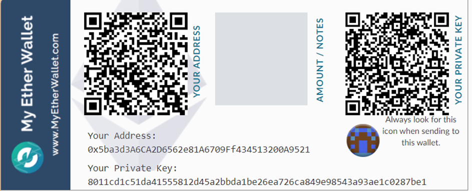

## W6L6
### Problem statement 
*Demonstrate setup of myetherwallet and connect it to Ganache Network, URL: https://www.tutorialspoint.com/ethereum/ethereum_myetherwallet.htm*

1. Go to myetherwallet html index file and open the main page. Now connect the myetherwallet to local ganache network as highlighted with black box. After connecting with ganache, servers gives a message, that the connection is successful.
  

2. We can deploy or interact with our contracts made in remix ide or a solidity program using myetherwallet under “contracts” tab. Then paste the bytecode of the contract and select a method for verification. We can choose private key. 
  

3. After selecting private key from ganache application. We can deploy the contract. We weren’t able to deploy the contract because of version problems of ganache and myetherwallet. Still the connection with ganache becomes successful 
  
 
  
 
  

4. We can create a wallet in myetherwallet as a keystore value. Which can be used as a password to verify the user of the account holder. Then we can print a paper wallet for our reference. 
  
 
  
