## W7L7
### Problem statement 
*Demonstrate setup of geth client to access Ethereum blockchain, URL: https://www.sitepoint.com/an-introduction-to-geth-and-running-ethereum-nodes/*

1. Install the geth, which is one of the original and most popular Ethereum clients. Install Go which is expressive, concise, clean, and efficient. Its concurrency mechanisms make it easy to write programs that get the most out of multicore and networked machines, while its novel type system enables flexible and modular program construction. After installing the necessary dependencies, check for the version on the system. The command prompt may not be able to find the libraries. So, then check for where the application is installed, and move to its bin folder. Then copy the address till bin folder into system environment variables, so that command prompt can recognize the commands from these applications.  
 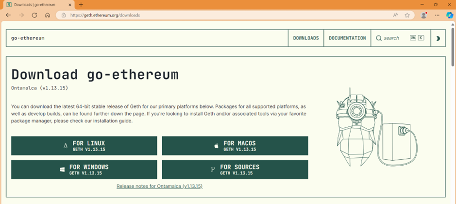 
 
 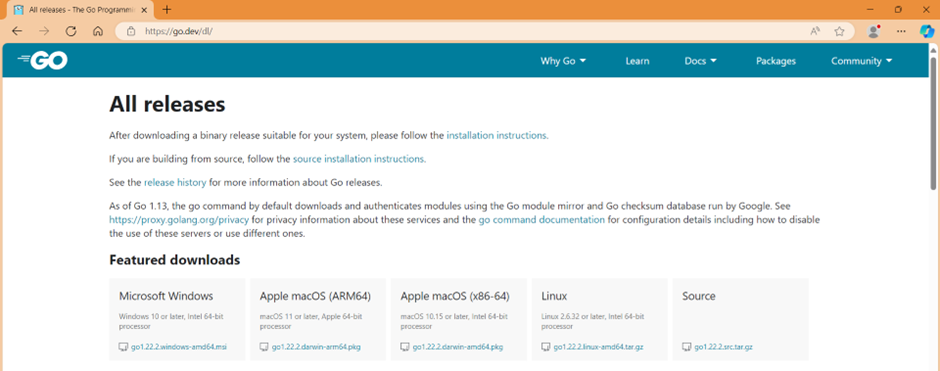 

2. Then create two accounts to perform transactions within the parties 
 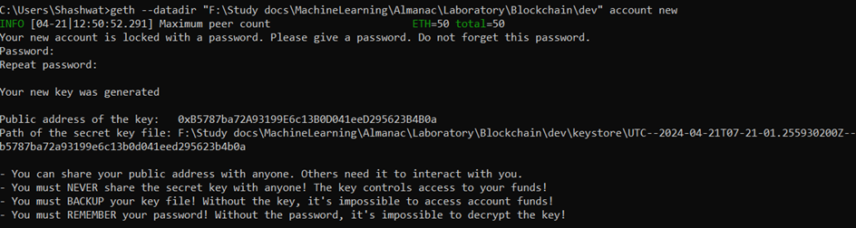 
 
 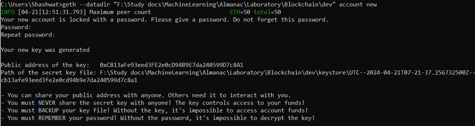 

3. Save password of first account in a secret.txt file, within the same folder of dev 
 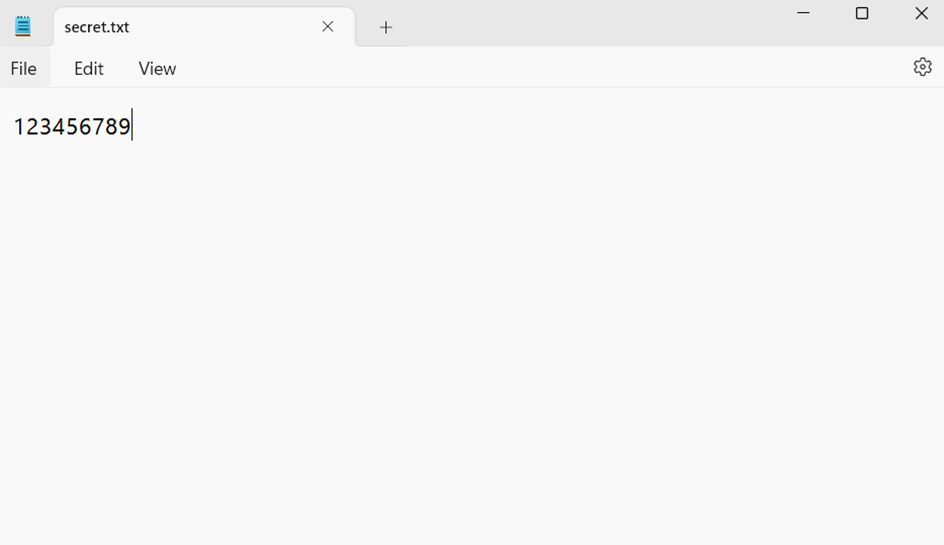 

4. Now type the command to run geth in developer mode 
 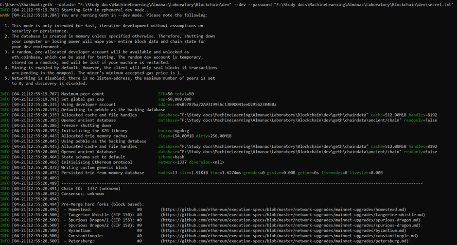 
 
 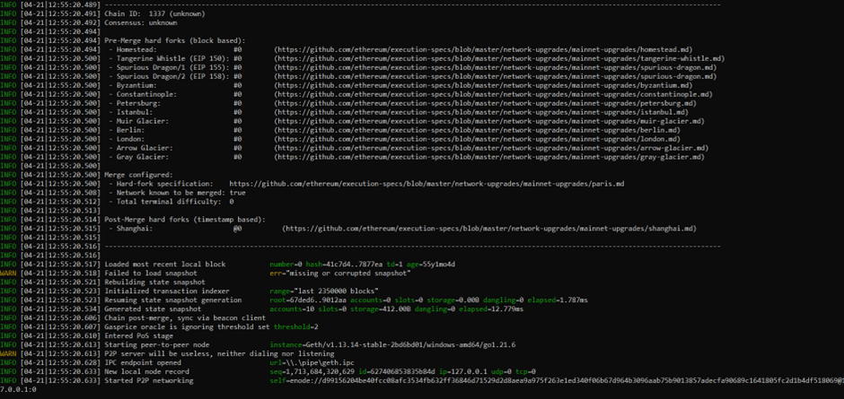 

5. Now open another terminal and type the command to communicate with existing node. This will open javascript console. 
 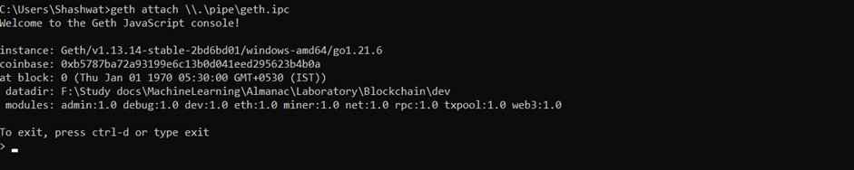 

6. Type eth to get a list of inbuilt commands  
 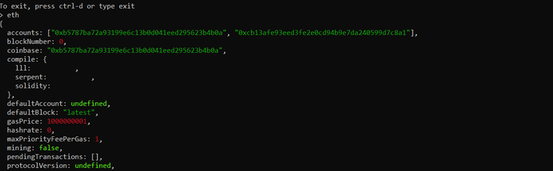 
 
 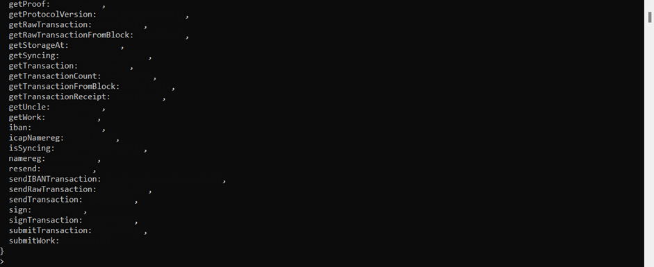 

7. We can get a list of active accounts using eth.accounts command 
 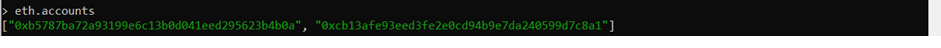 

8. We can perform transaction in geth command. It will generate a transaction hash. 
 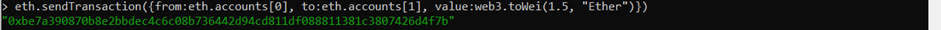 

9. To see the transaction details, we must switch to earlier command prompt, which was the starting point for developer mode 
 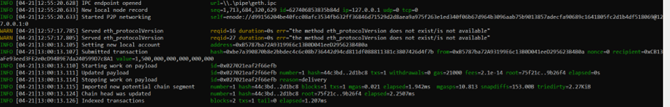 

