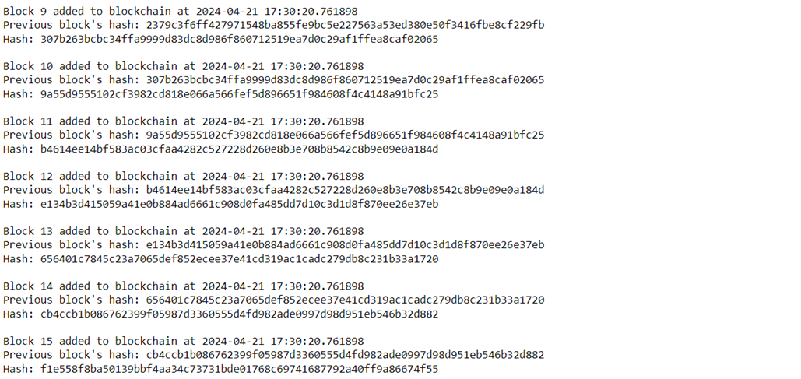

## W8L8
### Problem statement 
*Demonstrate the blockchain in python or java, URL: https://www.tutorialspoint.com/python_blockchain/python_blockchain_creating_multiple_transactions.html, https://www.geeksforgeeks.org/create-simple-blockchain-using-python/, URL: https://www.baeldung.com/java-blockchain*

1. Import necessary libraries 
```
#import python library we will use
from datetime import datetime
import hashlib as hasher
import json
```
2. Define a class block of the blockchain
```
class Block:
    def __init__(self, index, timestamp, data, previous_hash):
        self.index = index
        self.timestamp = timestamp
        self.data = data
        self.previous_hash = previous_hash
        self.hash = self.hash_block()
    
    #This function is used to print the block's index
    def showBlock(self):
        return json.dumps({
            'index': self.index,
            'timestamp': self.timestamp,
            'data': self.data,
            'previous_hash': self.previous_hash,
            'hash': self.hash
        })
    
    def hash_block(self):
        sha = hasher.sha256()
        seq = [str(self.index), str(self.timestamp), str(self.data), str(self.previous_hash)]
        sha.update(''.join(seq).encode('utf-8'))
        return sha.hexdigest()
```

3. Create genesis block
```
def make_genesis_block():
    """Make the first block in a block-chain."""
    block = Block(index=0,
                  timestamp=datetime.now(),
                  data="Genesis Block",
                  previous_hash="0")
    return block
```

4. Write a function to build a new block based on the previous block
```
def next_block(pre_block, data=''):
    """Return next block in a block chain."""
    idx = pre_block.index + 1
    block = Block(index=idx,
                  timestamp=datetime.now(),
                  data='This is block {}'.format(idx),
                  previous_hash=pre_block.hash)
    return block
```

5. Creating 15 blocks and linking them together.def 
```
run_simple_chain():
    """Test creating chain of 15 blocks."""
    blockchain = [make_genesis_block()]
    prev_block = blockchain[0]
    for _ in range(0, 15):
        block = next_block(prev_block, data='Change to anything you want')
        blockchain.append(block)
        prev_block = block
        print('Block {} added to blockchain at {}'.format(block.index, block.timestamp))
        print('Previous block\'s hash: {}'.format(block.previous_hash))
        print('Hash: {}\n'.format(block.hash))
```

6. Run the block chain
```
run_simple_chain() 
```
<div align="center">  </div>
<div align="center">  </div>