## W8L8
### Problem statement 
*Demonstrate hardhat blockchain tutorial, URL: https://hardhat.org/tutorial*

1. Explore the tutorial section of the hardhat platform. 
 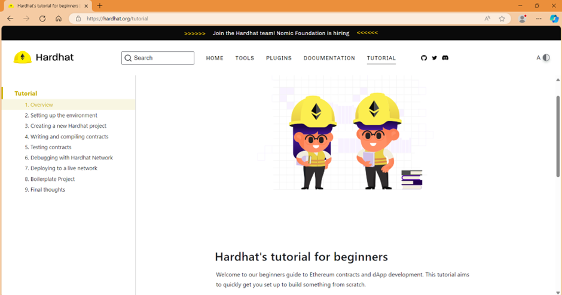 

2. Initialize npm into the repository and install hardhat for ethereum software development using command – npm init. 
 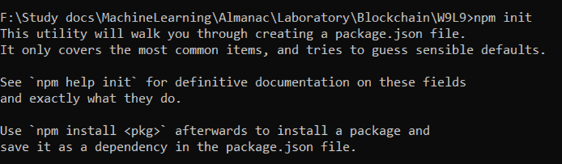 
 
 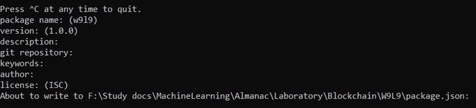 
 
 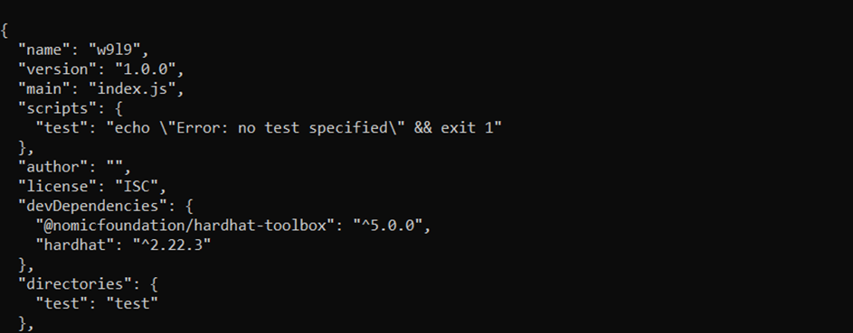 
 
 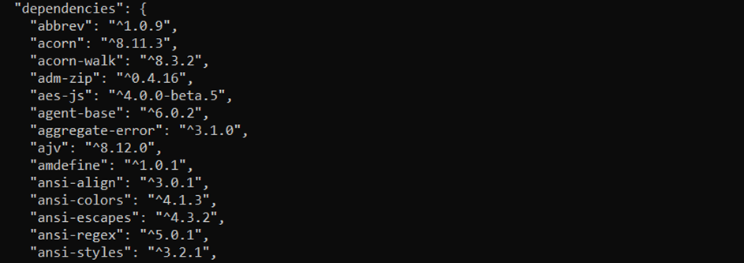 
 
 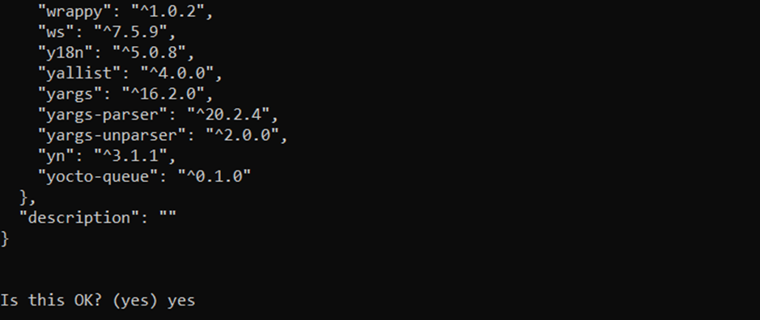 
 
 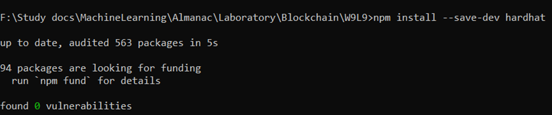 
 

3. The hardhat asks for what next we want to do. Select create an empty hardhat.config.js to proceed using command – npx hardhat init. 
 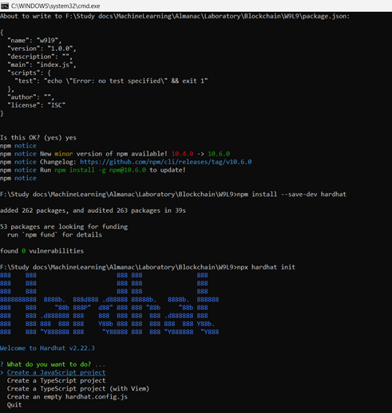 

4. Now download @nomicfoundation/hardhat-toolbox plugin from hardhat to develop smart contracts 
 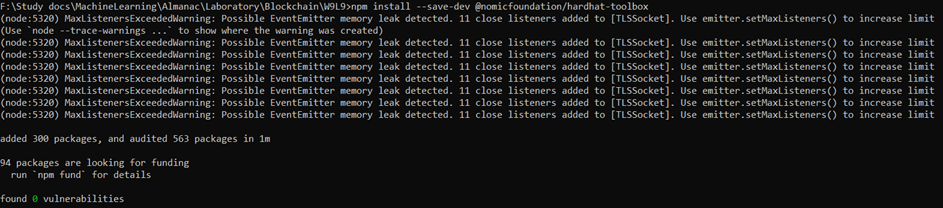 

5.  Create a simple contract and compile the program.
Using command – npx hardhat compile 
 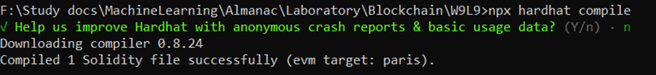 

6. Test the simple contract 
 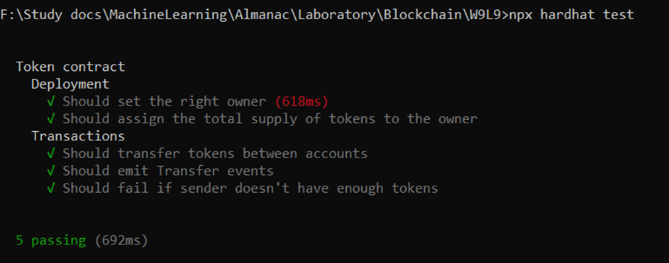 

7. Debug with hardhat network using console.log() method in function of contract using command - npx hardhat test 
 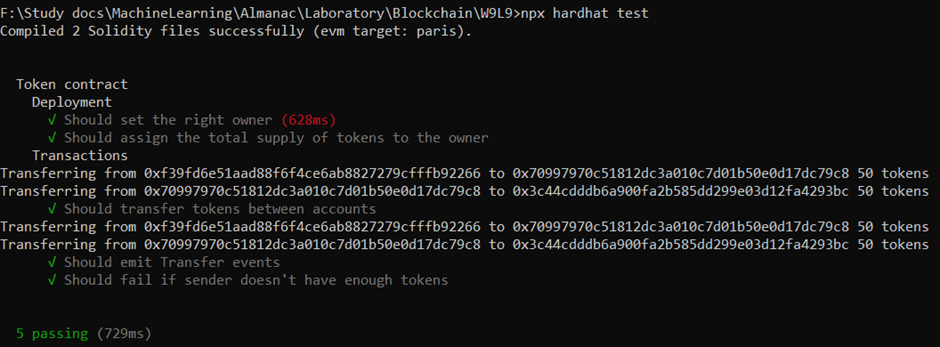 

8. Deploy contract to a live network using command - npx hardhat ignition deploy ./ignition/modules/Token.js 
 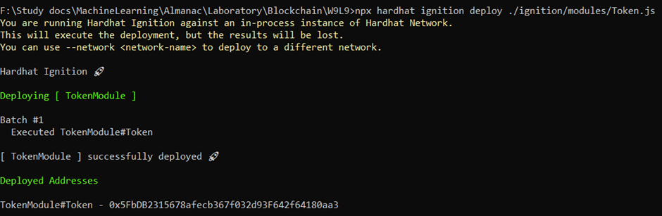 

8. Deploying in Hardhat ignition 
 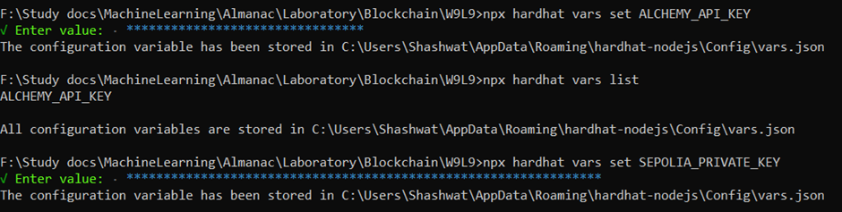 

9. Deploying on test network using command - npx hardhat ignition deploy ./ignition/modules/Token.js --network sepolia 
 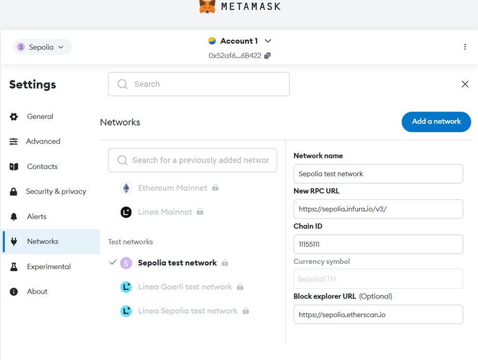 
 
 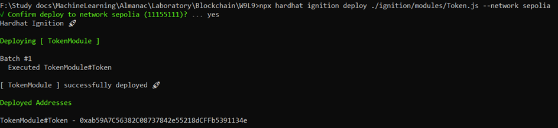 
